# Overview

## TODO: These are the high level goals for this repo

- [x] Set up Azure Functions project
- [ ] Implement Event Grid trigger function
- [ ] Implement Timer trigger function
- [ ] Set up Azure Storage account
- [ ] Integrate with Azure Blob Storage
- [ ] Integrate with Azure Queue Storage
- [ ] Implement error handling
- [ ] Write unit tests
- [ ] Deploy to Azure
- [ ] Monitor and log function activity
- [ ] Deployable via AZD cli with Biceps

## Overview of the Flow

```mermaid
architecture-beta
    group api(devicon:azure)[API]

    service db(database)[Database] in api
    service disk1(disk)[Storage] in api
    service disk2(disk)[Storage] in api
    service server(server)[Server] in api

    db:L -- R:server
    disk1:T -- B:server
    disk2:T -- B:db
```

